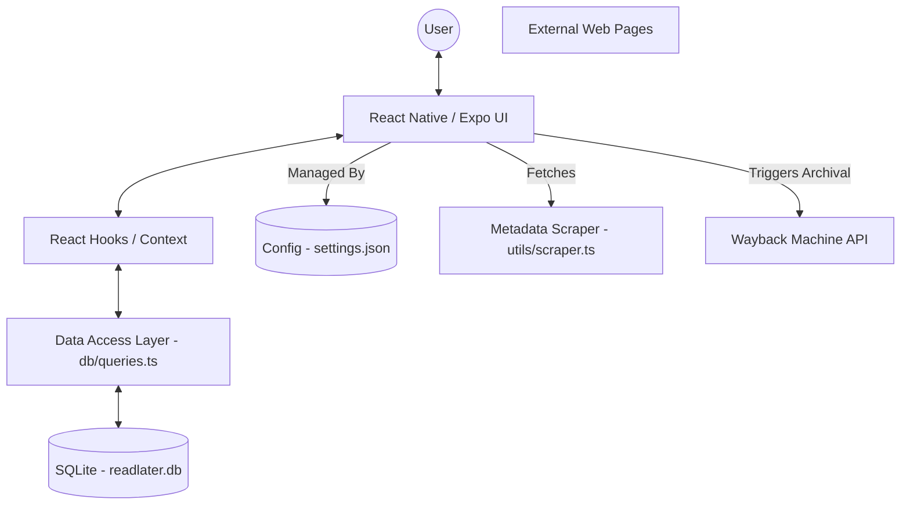
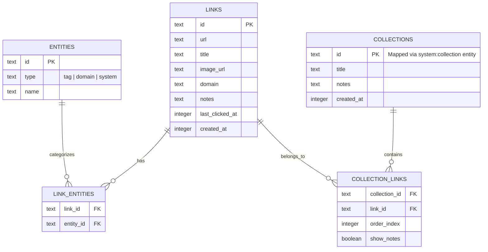

# System Design - ReadLater Mobile

ReadLater is a local-first mobile application designed for saving and organizing web links with rich metadata, tags, and notes.

## Architecture Overview

The application follows a **Local-First Architecture**, prioritizing offline availability and data privacy by storing all user content in a local SQLite database.

## Data Model

The database uses a consolidated **Shared Entity Pattern** to handle various metadata types (tags, domains, system markers) in a unified way.

### Schema Diagram

## Key Components

### 1. Unified Entity System ([db/queries.ts](file:///g:/Code/Node/ReadLater/apps/mobile/db/queries.ts))
- **Consolidated Storage**: Manages all categorizations (tags, domains, and system flags like `wayback`) through the `entities` and `link_entities` tables.
- **Legacy Cleanup**: Outdated `tags` and `link_tags` tables have been deprecated and removed to simplify the schema.

### 2. Developer Mode & Tooling
- **Consolidated Config**: A single `settings.json` file stores all application preferences, including the active database name (`dbName`) and Developer Mode status.
- **Developer Mode**: A persistent master toggle that unlocks advanced administrative features.
- **SQL Query Runner**: A native interface for running raw SQL commands against the local database, including:
    - **Safety Controls**: Prominent warning banners for write operations.
    - **Schema Explorer**: Real-time inspection of table definitions (`CREATE TABLE`).
    - **Quick Actions**: Wrapping selectable query chips for common workflows.

### 3. Wayback Machine Integration
- **Archival Layer**: Integrates with the Internet Archive's "Save Page Now" API to create permanent snapshots of saved links.
- **System Entities**: Uses the `system` entity type (e.g., `system:wayback`) to track which links have been archived without bloating the main `links` table.
- **Dynamic Generation**: Wayback URLs are generated on-the-fly using the link's `created_at` timestamp, ensuring consistent access to the specific version saved by the user.

### 4. Metadata Scraper ([utils/scraper.ts](file:///g:/Code/Node/ReadLater/apps/mobile/utils/scraper.ts))
- **Automatic Enrichment**: Fetches OpenGraph/Twitter tags and favicons from URLs.
- **Sanitization**: Robust HTML entity decoding and title cleaning.

### 5. Collection Management
- **Collections as Links**: Uses a shared entity pattern where collections are themselves saved as entries in the `links` table and identified via the `system:collection` entity type.
- **Ordered Relationships**: The `collection_links` table maintains user-defined ordering (`order_index`) and per-link display preferences (`show_notes`) for links within a collection.

### 6. Code Organization Principles
- **Extracted UI Components**: Rather than bloated monolithic screens, the UI is heavily componentized. Standard shared ui boundaries include isolated list rendering components, dedicated Modal fragments for edits and collection additions, and separated UI helpers.
- **Query Builders**: Database logic utilizes shared helper functions instead of repetitive, literal SQL strings to construct consistent `JOIN` statements across different entity domains.

## Core Workflows

### Saving a Link
1.  **Input**: User enters or pastes a URL.
2.  **Auto-Fetch**: After a 2-second debounce, the Scraper fetches page details.
3.  **Archival Option**: If Developer Mode is ON, users can toggle "Save to Wayback Machine".
4.  **Persistence**: 
    - Link is saved to `links`.
    - Domain is extracted and saved as a `domain` entity.
    - Tags are saved as `tag` entities.
    - If archival is enabled, a `system:wayback` entity is linked and the archival crawl is triggered.

## Technology Stack
- **Framework**: React Native with Expo (Managed Workflow)
- **Database**: `expo-sqlite` (Local persistent storage)
- **Navigation**: `expo-router` (File-based routing)
- **Storage**: `expo-file-system` for persistent configuration and settings.
- **Image Handling**: `expo-image` (High-performance caching and transitions)
